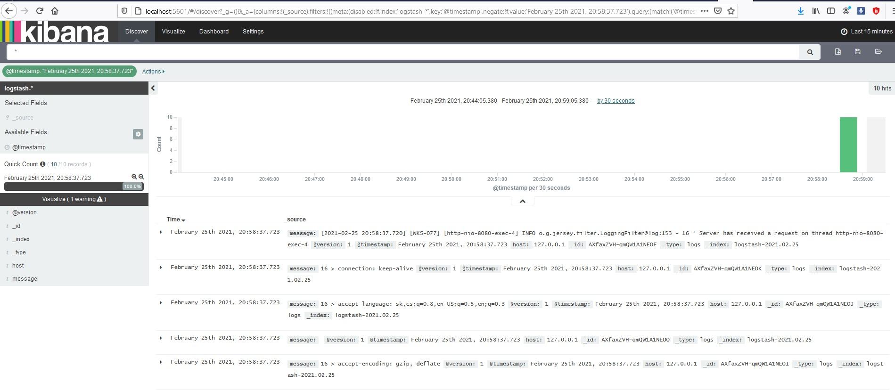

# enterprise-containers-comparison

The build time of TomEE uber WAR takes 5 minutes to complete.

Startup time:

| WildFly AS 10.1.0 | WidlFly Swarm | TomEE JAX-RS    | TomEE Full Stack | Spring Boot |
| :---------------- |:-------------:|:---------------:| :---------------:|------------:|
|    10 seconds     |  18 seconds   | 3 - 4 seconds   |   3 - 4 seconds  | 10 seconds  |


Boot JAR size:

| WildFly AS 10.1.0 | WidlFly Swarm | TomEE JAX-RS    | TomEE Full Stack | Spring Boot |
| :---------------- |:-------------:|:---------------:|:----------------:| -----------:|
|     170/240 MB    |      90MB     |      32 MB      |       52 MB      |    28 MB    |


Java Heap size (MB) after Full GC:

| WildFly AS 10.1.0 | WidlFly Swarm | TomEE JAX-RS    | TomEE Full Stack | Spring Boot |
| :---------------- |:-------------:|:---------------:|:----------------:| -----------:|
|       29 MB       |     56 MB     |      23 MB      |       19 MB      |    37 MB    |


## TomEE Embedded

The container starts with CLI `java -jar tomee-embedded/target/tomee-embedded-1.0-SNAPSHOT.war`
and the startup completes within

Check the connection via `telnet localhost 8080`.

If you use `<tomee.flavor>jaxrs</tomee.flavor>`, the technology stack contains:
CDI, JPA, JTA, JSP, JSTL, Servlet, Java Mail, Bean Validation, JAX-RS

References:

[Apache TomeEE](http://tomee.apache.org/apache-tomee.html)

## WildFly Swarm

Check the connection via browser with URL `http://localhost:8080/hello`

The technology stack is:

`Installed fraction:                  Logging - STABLE          org.wildfly.swarm:logging:2017.9.5`

`Installed fraction:          Bean Validation - STABLE          org.wildfly.swarm:bean-validation:2017.9.5`

`Installed fraction:        CDI Configuration - STABLE          org.wildfly.swarm:cdi-config:2017.9.5`

`Installed fraction:                   JAX-RS - STABLE          org.wildfly.swarm:jaxrs:2017.9.5`

`Installed fraction:             Transactions - STABLE          org.wildfly.swarm:transactions:2017.9.5`

`Installed fraction:                      CDI - STABLE          org.wildfly.swarm:cdi:2017.9.5`

`Installed fraction:                 Undertow - STABLE          org.wildfly.swarm:undertow:2017.9.5`


## Spring Boot


CLI: `java -jar spring-boot-1.0.0-SNAPSHOT.jar`

Check the connection:

[GET /rest/hello](http://localhost:8080/rest/hello)

[GET /rest/messages](http://localhost:8080/rest/messages)


## ELK (Logstash + Elasticsearch + Kibana)

### Old version of ELK

#### Elasticsearch 1.6.3
Download an older
[Java SE Development Kit 8u45](https://www.oracle.com/java/technologies/javase/javase8-archive-downloads.html) and
install it on your system, or set `JAVA_HOME`, example (on Windows) `set JAVA_HOME=c:\Program Files\Java\jdk1.8.0_45`
or `export JAVA_HOME=/usr/local/jvm/jdk1.8.0_45` (on Linux).

Download Elasticksearch from `https://download.elastic.co/elasticsearch/elasticsearch/elasticsearch-1.6.0.zip`,
extract the ZIP archive `elasticsearch-1.6.0.zip`, rename the directory `elasticsearch-1.6.0` to `elasticsearch`.

The Elasticsearch will create the directory named `data` with the database and Lucene indexes
for later textual search used in Kibana.

```
wget https://download.elastic.co/elasticsearch/elasticsearch/elasticsearch-1.6.0.zip
unzip elasticsearch-1.6.0.zip
mv elasticsearch-1.6.0 elasticsearch
echo "path.data: ./data" >> elasticsearch/config/elasticsearch.yml
```

Open the file `elasticsearch/config/logging.yml` and change the logger to WARN as follows:
```
es.logger.level: WARN
rootLogger: ${es.logger.level}, console, file
logger:
  # log action execution errors for easier debugging
  action: WARN
  # reduce the logging for aws, too much is logged under the default INFO
  com.amazonaws: WARN
  org.apache.http: WARN
```

Start the Elasticsearch on Linux `./elasticsearch/bin/elasticsearch`, or
on Windows `elasticsearch\bin\elasticsearch.bat`.

Use this address `http://172.18.105.224:9200/` in your browser. If you see JSON with `status: 200` then it means that
the server is working properly.


#### Logstash 1.5.3
Download the Logstash from `https://download.elastic.co/logstash/logstash/logstash-1.5.3.zip`, extract the ZIP archive
`logstash-1.5.3.zip`, rename the directory `logstash-1.5.3` to `logstash`.

```
wget https://download.elastic.co/logstash/logstash/logstash-1.5.3.zip
unzip logstash-1.5.3.zip
mv logstash-1.5.3 logstash
```

Run the Logstash as follows `./logstash/bin/logstash.bat agent -f logstash.conf` on Linux, or
`logstash\bin\logstash.bat agent -f logstash.conf` on Windows.


#### Kibana 4.1.1

Download the Kibana from `https://download.elasticsearch.org/kibana/kibana/kibana-4.1.1-linux-x64.tar.gz`, extract
the ZIP archive `kibana-4.1.1-linux-x64.tar.gz`, rename the directory `kibana-4.1.1-linux-x64` to `kibana`.
Alternatively, download Kibana for Windows from `https://download.elasticsearch.org/kibana/kibana/kibana-4.1.1-windows.zip`.

```
wget https://download.elasticsearch.org/kibana/kibana/kibana-4.1.1-linux-x64.tar.gz
tar -xzf kibana-4.1.1-linux-x64.tar.gz
mv kibana-4.1.1-linux-x64 kibana
```

Run the Kibana as follows `./kibana/bin/kibana` on Linux or `kibana\bin\kibana.bat` on Windows.

Open Kibana in browser, `http://localhost:5601`.



#### Run the application
Finally, run the application `cd spring-boot/target && java -jar spring-boot-1.0.0-SNAPSHOT.jar`.


## Latest version of ELK

Download the ZIP archives from [here](https://www.elastic.co/downloads/).


